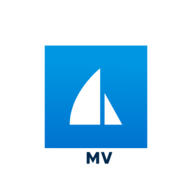

# MarineVerse



**Sailing: learn, relax, race**

Find your next step in sailing: explore learning resources, enjoy virtual
sailing and practise sailboat racing with a sailing simulator. Read MarineVerse
FAQs and release notes without an account. Connect your account when you want
help with your sailing progress, statistics, Globe boats and supported races.
Find real sailing clubs, schools and Sailability chapters by name, city or nearby coordinates without an account.
Link your account to list your clubs and pending requests, request to join a specific club or leave an active membership.

Try asking:

- “I dream of sailing around the world. Where can I start learning?”
- “Can I try sailing in a browser?”
- “How can I practise racing between trips on the water?”
- “What changed in MarineVerse Sailing Club?”
- “Find sailing schools in Melbourne.”
- “Show my clubs and pending requests.”
- “Join this club with my introduction.”
- “What should I practise next based on my MarineVerse progress?”

## Connect

Follow the current [MarineVerse connection guide](https://www.marineverse.com/mcp).
The hosted MCP server uses Streamable HTTP:

```text
https://api.marineverse.com/mcp
```

Public tools do not require a MarineVerse account. Personal data and writes use
OAuth account linking through MarineVerse. Available tools depend on the server
deployment and the assistant's integration; installing this repository does not
deploy new server capabilities.

## What's in this repository

- `skills/marineverse-mcp/SKILL.md`: shared sailing workflows for Claude and
  OpenAI assistants, with public guidance and connected-account behavior.
- `skills/marineverse-clubs/SKILL.md`: guest discovery of real sailing organizations and requested account membership actions.

- `plugin.json`: portable Agent Plugins manifest, OpenAI listing and review cases.
- `mcp.json`: portable Streamable HTTP connection to the hosted MCP server.
- `.mcp.json`: compatibility connection for Claude and older Codex clients.
- `.claude-plugin/plugin.json`: Claude plugin packaging.
- `.codex-plugin/plugin.json`: older Codex packaging and display metadata.

Skills keep their shared instructions short and load linked references only for the requested workflow.

All manifests use the same skills and hosted MCP endpoint. The repository/package
identifier is `marineverse-plugin`; the display name is **MarineVerse**.

The [MarineVerse CLI](https://github.com/marineverse/marineverse-cli) and its
[CLI skill](https://github.com/marineverse/marineverse-cli/tree/master/skills/marineverse-cli)
stay in their own repository. You do not need the CLI to use this plugin.

For local Claude Code testing, run `claude --plugin-dir .` from this repository.
For OpenAI testing, use the plugin import/developer workflow linked in
[release guidance](docs/releasing.md). Directory publication is a separate step;
cloning this repository does not create a public listing.

Public release preparation and outstanding publisher inputs are tracked in
[submission preparation](docs/submission-preparation.md). The current package
is a preparation draft, not an approved directory release.

## Scope

This repository's skills, documentation and plugin configuration are licensed
under [Apache-2.0](LICENSE). See [NOTICE](NOTICE) for copyright and trademark
attribution. The license applies to this repository; linked services and content
retain their own terms.

Public keyword search retrieves first-party FAQs and Sailing Club release history.
Knowledge base search finds sailing articles, and article lookup reads their full content. Both require an active MarineVerse membership.

MarineVerse is useful for practice; the plugin does not certify sailing ability,
provide live boat telemetry or make passage-planning decisions.

[Website](https://www.marineverse.com/) ·
[Learn to sail](https://www.marineverse.com/learn-how-to-sail) ·
[Practice](https://www.marineverse.com/sailors-mental-gym) ·
[Support](https://www.marineverse.com/contact)
